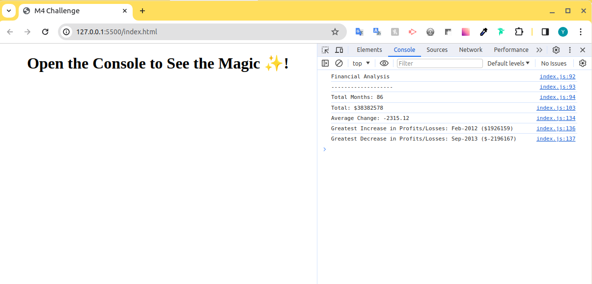

# Console Finances

## Description

### 1. Acceptance Criteria

* Your task is to write JavaScript code that analyzes the records to calculate each of the following:

* The total number of months included in the dataset.

* The net total amount of Profit/Losses over the entire period.

* The average of the changes in Profit/Losses over the entire period.

    - You will need to track what the total change in Profit/Losses are from month to month and then find the average.
    - (Total/(Number of months - 1))

* The greatest increase in Profit/Losses (date and difference in the amounts) over the entire period.

* The greatest decrease in Profit/Losses (date and difference in the amounts) over the entire period.

* When you open your code in the browser your resulting analysis should look similar to the following:

```
    Financial Analysis 
    ----------------
    Total Months: 86
    Total: $38382578
    Average Change: -2315.12
    Greatest Increase in Profits/Losses: Feb-2012 ($1926159)
    Greatest Decrease in Profits/Losses: Sep-2013 ($-2196167)

```
2. This project was built to explore new features of JavaScript
3. In the process of working on the project, I learned to work with `arrays`, what `concatenation` and the `for` loop are, I learned such methods as `.map` and `.reduce`
 



## Links

GitHub Repositories: https://github.com/Yaroslav09/console-finances

Deployed Application: https://yaroslav09.github.io/console-finances